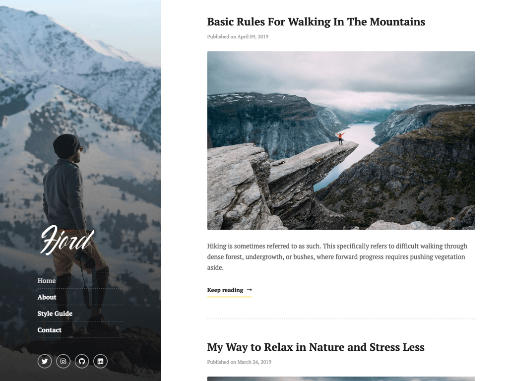

# Fjord - Stackbit Theme
A minimal blogging theme.

🖥️ [Live Demo](https://themes.stackbit.com/demos/fjord/) &nbsp;  &nbsp; 🚀 [New Fjord Site](http://app.stackbit.com/wizard?theme=fjord)

Taking inspiration from travel and nature, Fjord is a cleanly designed blog theme that can showcase beautiful and expansive photos. Fear not if photos are not your primary focus, it can easily adapt - removing the side bar image simply leaves a clean and pleasant dark background that contrasts your content pages.

## How to Use

For those unfamiliar with Stackbit here's how it works -

This Theme was built to work with Static Site Generators and Headless CMS, Stackbit supports a myriad of different options so you can use the tools you like or pickup new ones.

Whehter you like Jekyll, Hugo or want to learn about Gatsby.

Stackbit lets you pick your favorite Site Generator

Stackbit lets you pick the tools work with the tools you or experiment with new ones as creating a 
or those you want to experiment with and get your site up and running in minutes.

Whether you like Jekyll, Hugo, Gatsby 
